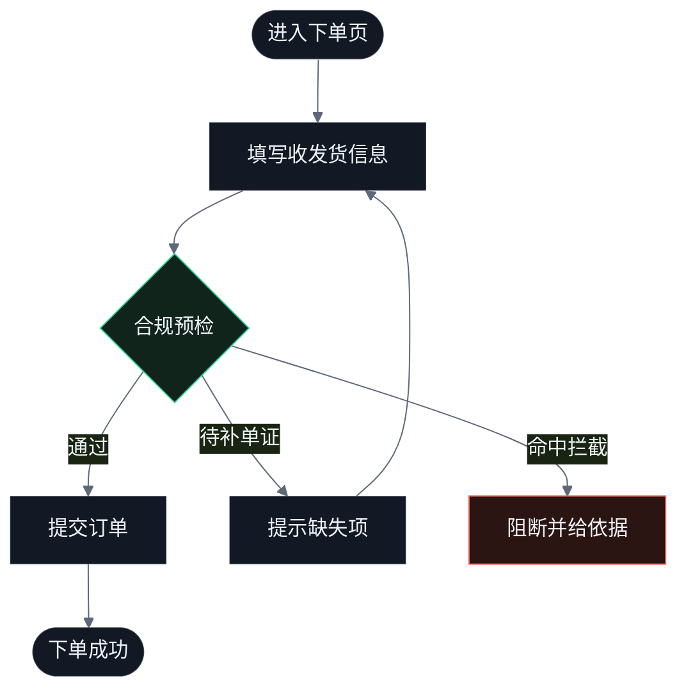

# 流程图 / 示意图能力（Diagrams & Flows）

ui-worker 画"流程类"图的约定。覆盖 UX 流程、页面流转、信息架构、用户旅程、通用业务流程图。目标：画出来是品牌化、有层次的图，不是默认 Mermaid 那种挤、丑、配色刺眼的样子。

## 选工具（先判断）

| 需求 | 用什么 |
|---|---|
| 快速表达流程逻辑、需要后续可改、放进 markdown/文档 | **Mermaid**（`.mermaid` 文件可直接渲染），套用下面的品牌主题 |
| 要做精排、当交付物/演示、强调视觉冲击 | **风格化 SVG/HTML**，继承 design tokens 与 [anti-slop-craft.md] |
| 技术架构图 / 时序图 / 基建拓扑 / 云资源图 | **不在本模块**——用 `creative/architecture-diagram` 技能，本模块到此为止，指过去即可 |

## 图的类型与画法

- **UX 用户流程（user flow）**：以"用户目标"为主线，从入口到完成。节点 = 用户动作 / 系统响应；菱形 = 决策分叉（含失败/异常分支）。必须画出空、错误、回退路径，别只画 happy path。
- **页面流转图（screen flow）**：节点 = 页面/弹层，箭头标触发动作（点击/提交/超时）。标清入口页与终止页。
- **信息架构 / 站点地图（IA）**：树状层级（`graph TD`），表达导航与归属，不表达时序。
- **用户旅程图（journey）**：用 Mermaid `journey` 或风格化 SVG 横向泳道，标阶段、行为、情绪/痛点。
- **通用业务流程图**：泳道（lane）按角色/系统分组，菱形决策，标注关键判定条件。

## Mermaid 品牌主题（深色，对齐 ui-worker tokens）

每张 Mermaid 图**开头注入这段 init**，让配色/字体与 ui-worker 一致（深空底、单一祖母绿强调、中性灰阶、无刺眼默认蓝）：

```
%%{init: {
  "theme": "base",
  "themeVariables": {
    "fontFamily": "Space Grotesk, Noto Sans SC, sans-serif",
    "fontSize": "15px",
    "background": "#0a0e15",
    "primaryColor": "#121925",
    "primaryBorderColor": "rgba(255,255,255,0.13)",
    "primaryTextColor": "#eef2f7",
    "lineColor": "#5d6878",
    "secondaryColor": "#161f2d",
    "tertiaryColor": "#0c111a",
    "edgeLabelBackground": "#0a0e15"
  }
}}%%
```

强调态（关键节点/主路径）用 classDef 单独上祖母绿，不要整图花：

```
classDef accent fill:#10241c,stroke:#34d399,color:#eef2f7;
classDef warn  fill:#241d0e,stroke:#f5b53d,color:#eef2f7;
classDef block fill:#2a1513,stroke:#f06a5d,color:#eef2f7;
```

示例（user flow，含异常分支）：



## 风格化 SVG/HTML（精排交付物）

当图要当交付物或上演示，用 SVG/HTML 手绘，继承 craft 层：

- 配色：深空底 `#0a0e15`、卡片 `#121925`、边框 `rgba(255,255,255,.07)`、单强调色祖母绿 `#34d399`、文本 `#eef2f7`/次 `#92a0b4`。
- 字体：标题/英文 Space Grotesk，中文 Noto Sans SC，编号/标签 JetBrains Mono。
- 节点：圆角统一（`rx=14` 左右），连线 1.5px、箭头收口干净；决策菱形或带色边卡片。
- **无 emoji**，图标一律 SVG（线宽 1.5 统一）。
- 留白充足，一图一个主线方向（自上而下或自左而右），别让线交叉成网。
- 长流程优先分泳道/分段，而非把所有节点塞一屏。

## 输出规范

- Mermaid → 存 `.mermaid` 文件（可内联渲染），或嵌进 markdown 设计稿的 ```mermaid 代码块。
- 精排图 → 单文件 `.svg` 或 `.html`。
- 在 UI 设计稿模板的"信息架构 / 页面详情"小节内联引用对应图。

## 自检

- [ ] 选对了工具(逻辑表达用 Mermaid / 精排用 SVG / 技术架构转 architecture-diagram)？
- [ ] Mermaid 是否注入了品牌 init，没用默认刺眼配色？
- [ ] 流程是否画了异常/空/回退分支，不只 happy path？
- [ ] 方向单一、连线不乱交叉、一图一主线？
- [ ] 无 emoji、强调色克制(只标关键节点)、文字对比达 WCAG AA？
